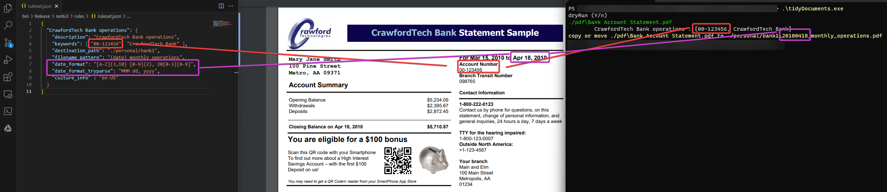

# tidyDocuments

Dead simple organisation windows console tool for reading pdf files, detects predefined keywords and move them to destination paths with dedicated name pattern.
Great to organize our tons of regular pdf files smoothly: bills, taxes, banks, ...

`No AI magic`, not necessary. However pre-defined keywords have to be defined before hand.

Anatomy of a detection rule
```json
{
  ...
  "bank account rule name" : {
    "keywords" : ["bank_account_number", "monthly report"], // all keywords have to match 
    "description" : "internal description for helping rules maintenance",
    "destination_path" : "destination folder", // if file wih same name already exists, choice will be given for next step
    "filename_pattern" : "{date}_bankABC_monthly report", // output file name pattern {date} will be replaced by extracted date. extract date info are carried with below settings.
    "date_format" : "[0-3][0-9]/[0-1][0-9]/20[0-3][0-9]", // date extraction following regex pattern
    "date_format_tryparse" : "dd/MM/yyyy", // dates detected with `date_format` will then be parsed with those datetime params (tryparseextact) (https://learn.microsoft.com/en-us/dotnet/standard/base-types/standard-date-and-time-format-strings)
    "date_skip": 1, // (optional) first parsed date has no interest ? skip it and take the second one
  }
  ...
}
```

Examples
* left : ruleset for detecting account `00-123456` from `CrawfordTech Bank` with date pattern `MMM dd, yyyy`
* middle : actual pdf
* right : output of `tidyDocument`, detecting both keyword, and suggest copy or move to rule expected destination

